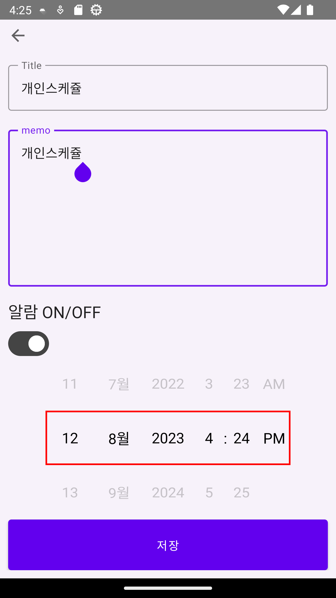
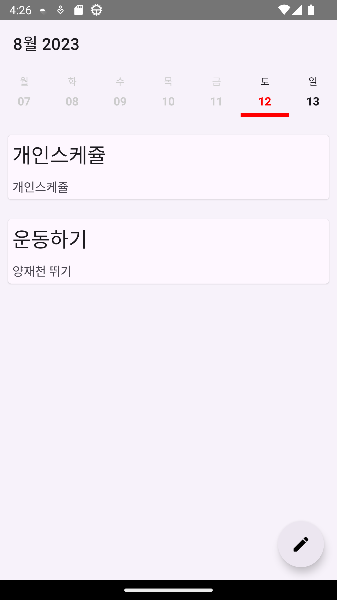
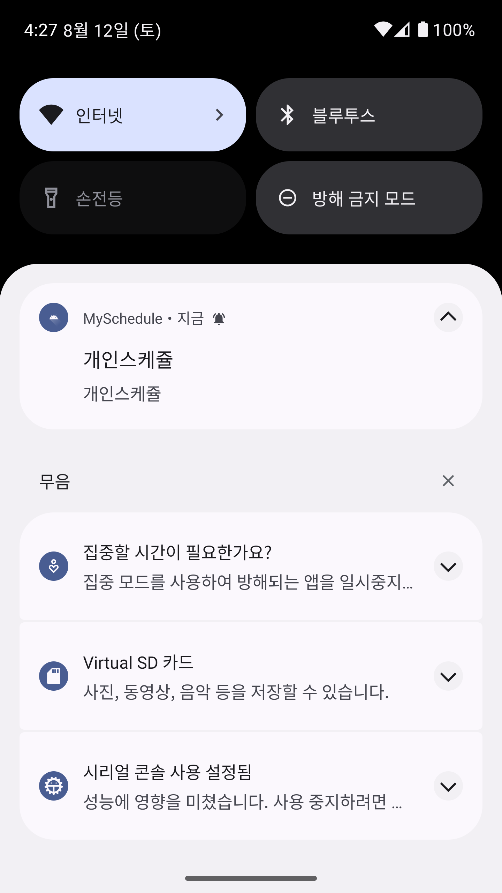

# MySchedule

나의 스케쥴 관리 알림 앱

## Introduction

추후 계속해서 기능을 추가할 예정입니다.

1. 스케쥴의 제목과 내용을 적고 알람 설정을 할수가 있습니다.
2. 등록된 스케쥴을 왼쪽으로 스와프 시 완료처리가 가능합니다.
3. 등록된 스케쥴을 오른쪽 스와프 시 삭제 및 알람 등록이 삭제됩니다.
4. 주 <->월 달력 변경기능 추가

## screenshot

</img>
</img>
</img>
</img>
</img>

## Development Environment

- Android Studio Electric Eel
- Android Compose 1.5.0-beta01
- Room

## Application Version

- minSdkVersion : 26
- targetSdkVersion : 33

## License

MyScheduleApp is released under the MIT License. http://www.opensource.org/licenses/mit-license